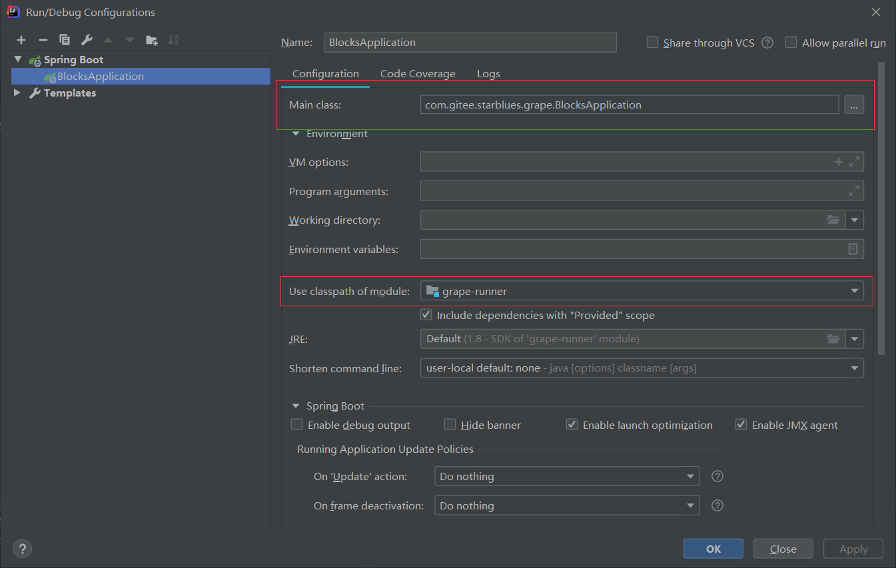
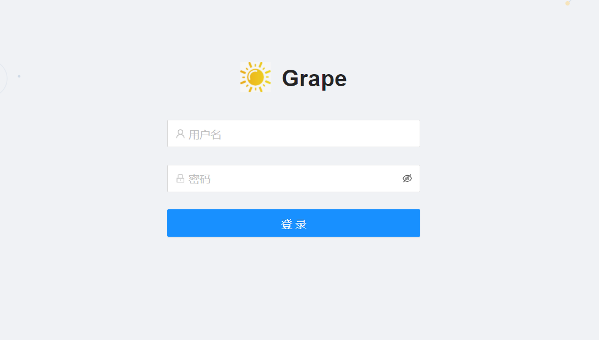
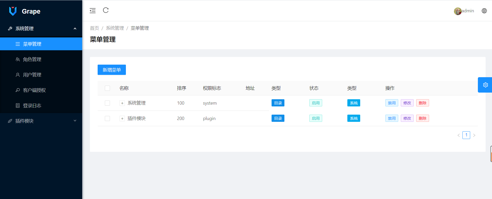
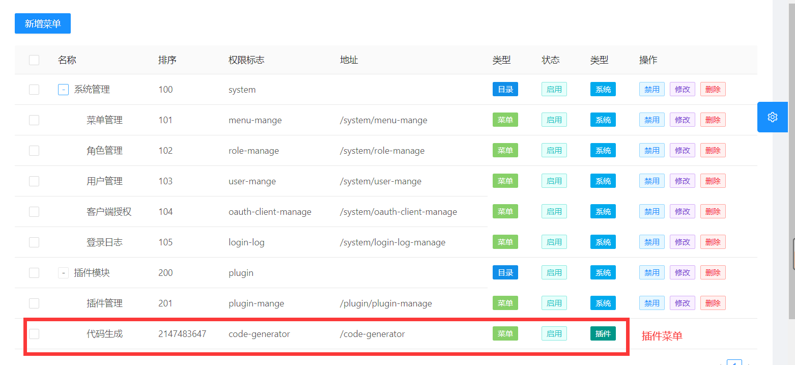
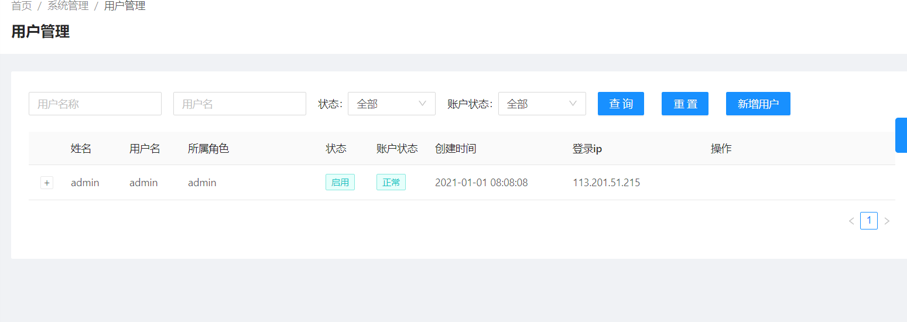
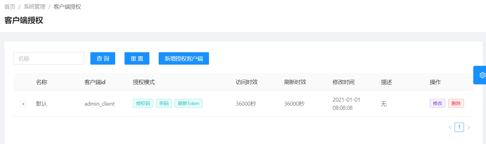
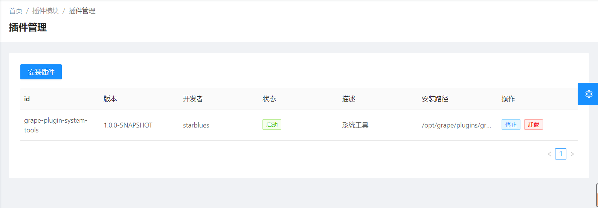
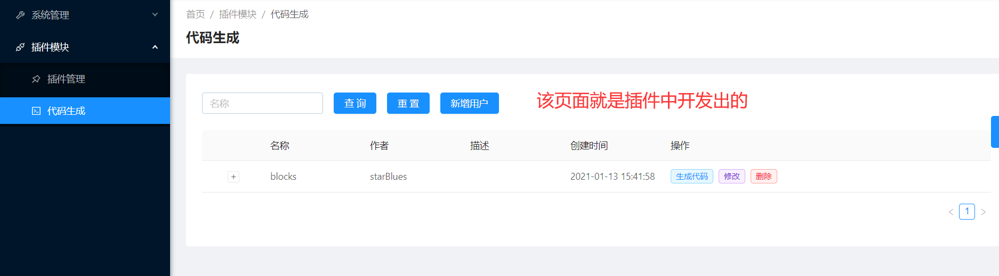

# grape

#### 介绍
前后端可插件开发的后台管理系统
- 可在后端进行插件化开发
- 可在前端进行插件化开发, 并且支持动态插入导航菜单

#### 目录
```text
bin: 生成环境启动停止脚本
grape-core: 系统合并模块
    grape-runner: 生产环境运行模块
    grape-server: 主程序模块
    grape-web: 主前端
grape-plugins: 插件模块
    grape-plugin-system-tools: 系统工具插件
sql: sql文件 
```

#### 软件架构
##### 后端
- 基础: SpringBoot 2.4.2
- 安全: SpringSecurity+JWT+Oauth2
- 接口文档: Swagger2
- 持久层: Mybatis+Mybatis-Plus
- 插件框架: Springboot-Plugin-Framework 2.4.0
##### 前端
- 基础: Vue+Antdv+AntdvPro
- 微前端: Qiankun
##### 数据库
- Mysql

#### 功能介绍


#### 安装教程

#### 初始化数据库
将 `sql` 文件夹 `grape.sql` 初始化到`mysql`中

##### 开发环境启动
1. mvn clean install -Dmaven.test.skip=true
2. `grape-server`中配置数据库连接
3. 配置如下

4. 启动

##### 打包生产环境
1. windows下执行: `package.bat`
2. 进入 `dist` 
3. 执行`startup.cmd` 或者 `startup.cmd`

##### 演示图
- 登录页面

- 主页面

- 菜单管理页面

- 用户管理页面

- 授权客户端管理页面

- 插件管理页面

- 插件中开发的页面


##### 演示地址
[演示地址](http://39.99.159.68:9000/web)
- 用户名密码: admin/123456


#### 参与贡献

1.  Fork 本仓库
2.  新建 Feat_xxx 分支
3.  提交代码
4.  新建 Pull Request
